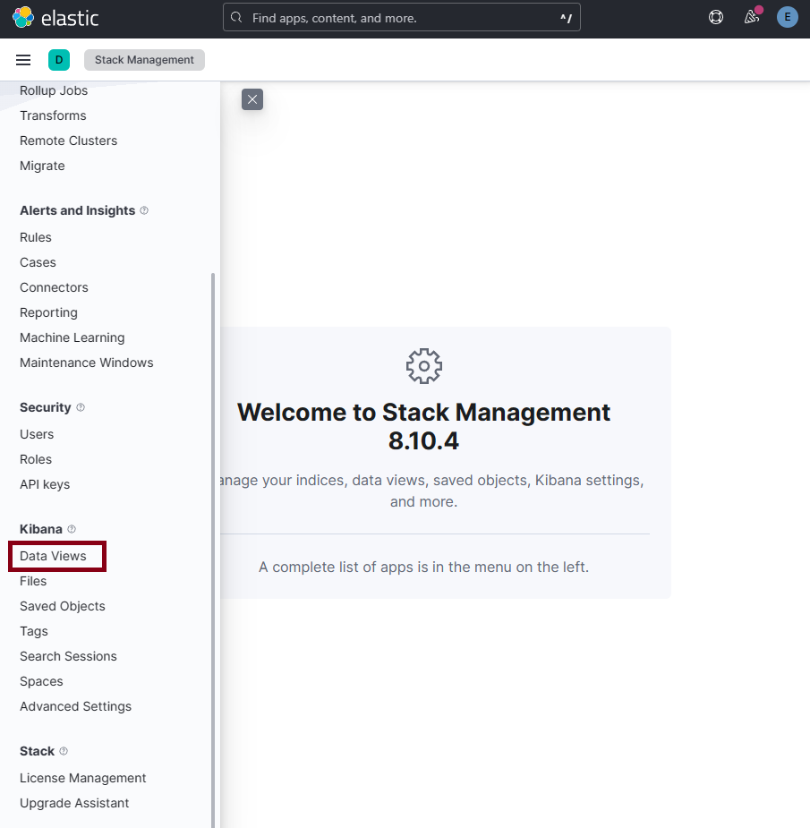

# Using Machine Learning on data with Elasticsearch

A lot of data sources often represent trends or insights that are hard to capture using a predifined rule or query. Look at the following example scenarios. 
* An environment has logs which gets streamed from about 5000 endpoints
* In an environment only a subset of endpoints starts to show intermittent failures in the application, but the machine is not down. 
* There is a overall drop in the log volume from an application but it is not drastic enough for a predefined rule to trigger an alert. 

Its is very difficult to detect this sort of issues with standard predifined rule based alerts. These are ideal candidates for anomaly detection. We can create baseline machine learning models using elasticsearch and then use those models to generate alerts if anomalous activity is detected. 


Let's try out Machine Learning features in elasticsearch. First we need to load some sample data into out elasticsearch cluster. 

```bash
pwd
cd /home/vagrant/webapp
# Setting up the index and the index pipeline
./setup-index-and-ingest-pipeline.sh
# loading the sample data
./ingest-webapp-data.sh

```

One loaded we can then verify that in elasticsearch

```python
GET webapp/_search
GET webapp-tagged/_search

```
## Looking for Anomalies in Time Series Data

### Trying to find anomalous event rates in application logs

#### Preparing the Data for Analysis

* Setup 1 - Setting up a Data View using the Web App Index 

First we need to select the Statck Management App from the Kibana Main memu. 



Then we need to create a new Data View using the Webapp Index pattern. 


The created webapp data view. 


Let's go the Discover App and check for data. 


Then we need to select the WebApp index pattern 


Since this is not a realtime data feed, but a historical data set. We need to adjust the time range. 

 

We can now see the webapp data. 


* Step 2 - Enabling a Trial 30 License to use Elasticsearch Machine Learning features


We can see that its' asking to enable a trial license, since we don't have a proper valid license which has machine learning capabilities. Therefore, select the Start Trial option. 


Now we should see that the Trial Key is activated. 


Now let us go back to machine learning app. 

 


#### Starting with Anomaly Detection

* Create a Machine Learning Job


We need to select a data view to specify which data set is to be used by the machine learning job


Let us start with a single metric anomaly detection job. 


We then need to select the time range to specify which data set is to be used in the model training. Here we are going to select the full data set option. 


* Configuring the Machine Learning Job

Once the data view is created with the right index and data set is selected with the correct time range, the next step is to configure the machine learning job. 

Let's select COUN(Event_Rate), where we are asking to count the number of events in the time series data set to find anomalies. The COUNT function will take into account both high and low count anomalies, both of which are interesting from an analysis perspective.


Next, we need to configure the buckt size. Elasticsearch will break the data set into multiple segments based on the bucket size to determine the anomaly. The bucket size can be allowed to be auto detected by elasticsearch. But for this scenario, let us select 1 minute (1m) as the bucket size. The bucket span determines how the time series data is grouped for the analysis. Smaller the bucket span more granular will be the analysis. But that will create a large number of buckets and therefore the analysis will be more resource intensive. On the otherhand larger the bucket span , less extreme anomalies may be suppressed. 


Then we need to give a name to the machine learning job. 


Validating the job configuration. 


Now, we can create the job. 


After few seconds or minutes (depending your elasticsearch node configuration) the job should finish. 


Let us now view the results of the ML Job. Click on the view results button, and that will take you to the results page. We can see that some anomalies were detected. Let's move the time slider and focus on the time period where the anomalies were detected. 


We can see that in days between 6thh to 9th there were some anomalous activity in the event count. This means that we now need to dig deeper into this scenario for to furhter discover new insights. 

Additionally we can forecast the behanior for any number of days using the forecast option. But The data set we have is not enough for accurate forecasting. 


Forecast results


* Digging Deeper into the Analysis with Multi Metric ML Jobs

During the previous analysis we noted that there had been an unexpected and anomalous spike in the number of requests received by the web app (event rate). For us to further investigate this, let's now try to look at the amount of data sent and received by the application. For that we need to use a multi metric anomaly detection job. 

Let us now dig a little deeper into the issue which we identified earlier. Now let's try to create a multi metric machine learning job to further analyse the problem. 


This time let us try to analyze the data transfer volumes. *http.response.bytes* and *http.request.bytes* to find out whether some anomalous behavior can be detected on that metric. 


Select Multi Metric option


As done previously, let's select the time range. 


* Configuring the Multi Metric ML Job

Let's select the *MEAN(http.response.bytes)* as the metric


Further configure the job


Give a name to the ML job


Validate the ML job


Create the ML Job


After few seconds, the Job should finishe successfully. 


We can clearly see some anomalies in the MEAN of *http.response.bytes*


Details of the anomalous events


      + Anomalous data transfer volumes were first observed on admin/login.php, where volumes were more than 100x higher than expected. Traffic was seen from a single source.ip address with a geo-location in Malaysia (which happens to be outside the normal and expected geo-locations for this application). 
	    + The same source IP address was later seen interacting with user/customer.php and user/order.php with anomalous data transfer volumes (64x higher than expected) compared to all other source IP addresses in the environment (as shown by the following graph):
	    + The anomalous activity continued for a brief period of time on 2 consecutive days after initial activity, with similarly high-volume traffic patterns. 
	    + When analyzing the event rate in the previous job, there was only one big spike in events, around the time when admin/login.php saw high volumes. This means that the high volumes seen on the latter URL paths (such as user/customer. php and user/order.php) were through a small number of transactions. 
	    + This would indicate that an unauthorized user (from a singular source IP address) likely gained access to the application (from the initial spike in events) and subsequently sent requests to download large amounts of data


* Population Analysis ML Jobs 

We were able to find an suspicious IP address from the Multi Metric Anomaloy Detection job. Let us now see whether we can confirm the same with further analysis using a ***Population Analysis***. 


As previous, selecting the time rage of the data set. 


Configuring the ML Job


Give a name to the ML Job


Create the JOB


Let us now view the results. 


Summarizing the Results for the Source IP addresses


Further details about the anomalous Source IP address. 


As expected, there is a singular source IP that stands out with anomalous activity, both in terms of event rate and data transfer volumes compared to the rest of the population. You can also view it by the *user_agent.name* value and see that most of the anomalous requests came from curl and a version of Firefox.


* Let us now go the ***Elastic Discover App** to further dig into the actual event details. 

Let's go to the *Elastic Discover App*


We can configure what information we want to see from the actual Event details. 


## Classification Analysis with Elasticsearch. 

***Data Frame Analytics*** in *elasticsearch* provides two main features for running two types of ML Jobs. 
    + *Regression*: Used to predict scaler values for fields
    + *Classification*: Uses to predict a category of a given event. 

Let us now look at a ***Classification*** type of ML Analsys using Elasticsearch

* Create another Data View 

*Classification* Type of ML Analysis needs a *Labeled Data Set*. When we were preparing the elasticsearch lab earlier the tagged data set was alreay automatically indexed into a new *index* called *webapp-tagged*. We can verify that. 

```python
GET webapp-tagged/_search
```


Data view created


* Select Data Frame Analysis from Elasticsearch Machine Learning App

The *Classification, regression* type of analysis is given under the *Data Frame Analysis* section in Elasticsearch 


Let us create another machine learning job. This time we will create a classification job.

Select the webapp-tagged as the Data View. 


Select *Classification*


* Let us now configure the *Classification ML Job*


We need to select below parameters 
+ event.action
+ http.request.bytes
+ http.request.method
+ http.response.bytes
+ http.response.status_code
+ url.path


No additional parameters for this use case


Give a name to the classification ML Job


Validate the Job


Create *Classification ML Job*


Let's now go back to the data frame analsys to view the results. 


Classification Job finished execution


Let's look at the results 


The trained models section. 


### Inferring Against Incoming Data Using ML in Elasticsearch

Now we are going to create an *ingest pipeline* and configure it to use the *machine learning model* which we created earlier using the *classification ml job*. 

> #### NOTE :
> We need to change the *model_id* of the *ML Mode* in the below code. We need to take the *model id* generated in our cluster with previous *classification job*

```python
# We have to replace the model ID with the right Model ID from the Trained Modeled Section in ML App
PUT _ingest/pipeline/ml-malicious-request
{
  "processors": [
    {
      "inference": {
        "model_id": "classification-request-payloads-1697362970419",
        "inference_config": {
          "classification": {
            "num_top_classes": 2,
            "results_field": "predicion",
            "top_classes_results_field": "probabilities"
          }
        }
      }
    }
  ]
}

```

Now we can simulate the pipeline to verify the *classification* task during data ingestion. First let's take few malicious data.

```python
POST _ingest/pipeline/ml-malicious-request/_simulate
{
  "docs": [
    {
      "_index": "webapp",
      "_type": "_doc",
      "_id": "SeeIMngBVgrfkQdcKGHW",
      "_score": 1,
      "_source": {
        "user.name": "administrator",
        "source": {
          "geo": {
            "continent_name": "Europe",
            "country_iso_code": "SE",
            "country_name": "Sweden",
            "location": {
              "lon": 18.056,
              "lat": 59.3247
            }
          },
          "ip": "5.254.192.11"
        },
        "url": {
          "path": "admin/login.php",
          "scheme": "https",
          "domain": "host-systems.net",
          "full": "https://host-systems.net/admin/login.php"
        },
        "http.request.bytes": "208",
        "event.action": "authenticate",
        "@timestamp": "2021-03-13T13:10:15.000Z",
        "http.request.method": "POST",
        "http.response.bytes": "10",
        "http.response.status_code": "403",
        "event.kind": "request",
        "event.dataset": "weblogs",
        "user_agent": {
          "original": "Mozilla/5.0 (X11; U; Linux i686; de; rv:1.8.0.5) Gecko/20060731 Ubuntu/dapper-security Firefox/1.5.0.5",
          "os": {
            "name": "Ubuntu"
          },
          "name": "Firefox",
          "device": {
            "name": "Other"
          },
          "version": "1.5.0"
        }
      }
    },
    {
      "_index": "webapp",
      "_type": "_doc",
      "_id": "SueIMngBVgrfkQdcKGHW",
      "_score": 1,
      "_source": {
        "user.name": "administrator",
        "source": {
          "geo": {
            "continent_name": "Europe",
            "country_iso_code": "SE",
            "country_name": "Sweden",
            "location": {
              "lon": 18.056,
              "lat": 59.3247
            }
          },
          "ip": "5.254.192.10"
        },
        "url": {
          "path": "admin/login.php",
          "scheme": "https",
          "domain": "host-systems.net",
          "full": "https://host-systems.net/admin/login.php"
        },
        "http.request.bytes": "210",
        "event.action": "authenticate",
        "@timestamp": "2021-03-13T13:10:30.000Z",
        "http.request.method": "POST",
        "http.response.bytes": "10",
        "http.response.status_code": "403",
        "event.kind": "request",
        "event.dataset": "weblogs",
        "user_agent": {
          "original": "Mozilla/5.0 (X11; U; Linux i686; de; rv:1.8.0.5) Gecko/20060731 Ubuntu/dapper-security Firefox/1.5.0.5",
          "os": {
            "name": "Ubuntu"
          },
          "name": "Firefox",
          "device": {
            "name": "Other"
          },
          "version": "1.5.0"
        }
      }
    },
    {
      "_index": "webapp",
      "_type": "_doc",
      "_id": "SOeIMngBVgrfkQdcKGHV",
      "_score": 1,
      "_source": {
        "user.name": "administrator",
        "source": {
          "geo": {
            "continent_name": "Europe",
            "country_iso_code": "SE",
            "country_name": "Sweden",
            "location": {
              "lon": 18.056,
              "lat": 59.3247
            }
          },
          "ip": "5.254.192.10"
        },
        "url": {
          "path": "admin/login.php",
          "scheme": "https",
          "domain": "host-systems.net",
          "full": "https://host-systems.net/admin/login.php"
        },
        "http.request.bytes": "209",
        "event.action": "authenticate",
        "@timestamp": "2021-03-13T13:10:48.000Z",
        "http.request.method": "POST",
        "http.response.bytes": "10",
        "http.response.status_code": "403",
        "event.kind": "request",
        "event.dataset": "weblogs",
        "user_agent": {
          "original": "Mozilla/5.0 (X11; U; Linux i686; de; rv:1.8.0.5) Gecko/20060731 Ubuntu/dapper-security Firefox/1.5.0.5",
          "os": {
            "name": "Ubuntu"
          },
          "name": "Firefox",
          "device": {
            "name": "Other"
          },
          "version": "1.5.0"
        }
      }
    },
    {
      "_index": "webapp",
      "_type": "_doc",
      "_id": "RueIMngBVgrfkQdcKGHV",
      "_score": 1,
      "_source": {
        "user.name": "administrator",
        "source": {
          "geo": {
            "continent_name": "Europe",
            "country_iso_code": "SE",
            "country_name": "Sweden",
            "location": {
              "lon": 18.056,
              "lat": 59.3247
            }
          },
          "ip": "5.254.192.10"
        },
        "url": {
          "path": "admin/login.php",
          "scheme": "https",
          "domain": "host-systems.net",
          "full": "https://host-systems.net/admin/login.php"
        },
        "http.request.bytes": "207",
        "event.action": "authenticate",
        "@timestamp": "2021-03-13T13:10:18.000Z",
        "http.request.method": "POST",
        "http.response.bytes": "10",
        "http.response.status_code": "403",
        "event.kind": "request",
        "event.dataset": "weblogs",
        "user_agent": {
          "original": "Mozilla/5.0 (X11; U; Linux i686; de; rv:1.8.0.5) Gecko/20060731 Ubuntu/dapper-security Firefox/1.5.0.5",
          "os": {
            "name": "Ubuntu"
          },
          "name": "Firefox",
          "device": {
            "name": "Other"
          },
          "version": "1.5.0"
        }
      }
    }
  ]
}
```

Now let us see some not malicious data. 

```python
POST _ingest/pipeline/ml-malicious-request/_simulate
{
  "docs": [
    {
      "_index": "webapp",
      "_type": "_doc",
      "_id": "Yed0MngBVgrfkQdcHl3S",
      "_score": 1,
      "_source": {
        "user.name": "u110191",
        "source": {
          "geo": {
            "continent_name": "North America",
            "country_iso_code": "US",
            "country_name": "United States",
            "location": {
              "lon": -97.822,
              "lat": 37.751
            }
          },
          "ip": "64.213.79.243"
        },
        "url": {
          "path": "user/manage.php",
          "scheme": "https",
          "domain": "host-systems.net",
          "full": "https://host-systems.net/user/manage.php"
        },
        "http.request.bytes": "132",
        "event.action": "view",
        "@timestamp": "2021-03-15T10:20:00.000Z",
        "http.request.method": "POST",
        "http.response.bytes": "1417",
        "event.kind": "request",
        "http.response.status_code": "200",
        "event.dataset": "weblogs",
        "user_agent": {
          "original": "Mozilla/5.0 (X11; CrOS x86_64 13597.94.0) AppleWebKit/537.36 (KHTML, like Gecko) Chrome/88.0.4324.186 Safari/537.185",
          "os": {
            "name": "Chrome OS",
            "version": "13597.94.0",
            "full": "Chrome OS 13597.94.0"
          },
          "name": "Chrome",
          "device": {
            "name": "Other"
          },
          "version": "88.0.4324.186"
        }
      }
    },
    {
      "_index": "webapp",
      "_type": "_doc",
      "_id": "Yud0MngBVgrfkQdcHl3S",
      "_score": 1,
      "_source": {
        "user.name": "u110999",
        "source": {
          "geo": {
            "continent_name": "Oceania",
            "region_iso_code": "AU-VIC",
            "city_name": "Dandenong North",
            "country_iso_code": "AU",
            "country_name": "Australia",
            "region_name": "Victoria",
            "location": {
              "lon": 145.2111,
              "lat": -37.9566
            }
          },
          "ip": "101.161.219.38"
        },
        "url": {
          "path": "user/customer.php",
          "scheme": "https",
          "domain": "host-systems.net",
          "full": "https://host-systems.net/user/customer.php"
        },
        "http.request.bytes": "126",
        "event.action": "view",
        "@timestamp": "2021-03-15T10:50:00.000Z",
        "http.request.method": "POST",
        "http.response.bytes": "1097",
        "event.kind": "request",
        "http.response.status_code": "200",
        "event.dataset": "weblogs",
        "user_agent": {
          "original": "Mozilla/5.0 (X11; CrOS x86_64 13597.94.0) AppleWebKit/537.36 (KHTML, like Gecko) Chrome/88.0.4324.186 Safari/537.200",
          "os": {
            "name": "Chrome OS",
            "version": "13597.94.0",
            "full": "Chrome OS 13597.94.0"
          },
          "name": "Chrome",
          "device": {
            "name": "Other"
          },
          "version": "88.0.4324.186"
        }
      }
    },
    {
      "_index": "webapp",
      "_type": "_doc",
      "_id": "Y-d0MngBVgrfkQdcHl3S",
      "_score": 1,
      "_source": {
        "user.name": "u110003",
        "source": {
          "geo": {
            "continent_name": "Oceania",
            "region_iso_code": "AU-VIC",
            "city_name": "Dandenong North",
            "country_iso_code": "AU",
            "country_name": "Australia",
            "region_name": "Victoria",
            "location": {
              "lon": 145.2111,
              "lat": -37.9566
            }
          },
          "ip": "101.161.219.38"
        },
        "url": {
          "path": "user/stats.php",
          "scheme": "https",
          "domain": "host-systems.net",
          "full": "https://host-systems.net/user/stats.php"
        },
        "http.request.bytes": "15",
        "event.action": "view",
        "@timestamp": "2021-03-15T11:20:00.000Z",
        "http.request.method": "GET",
        "http.response.bytes": "534",
        "event.kind": "request",
        "http.response.status_code": "200",
        "event.dataset": "weblogs",
        "user_agent": {
          "original": "Mozilla/5.0 (X11; CrOS x86_64 13597.94.0) AppleWebKit/537.36 (KHTML, like Gecko) Chrome/88.0.4324.186 Safari/537.215",
          "os": {
            "name": "Chrome OS",
            "version": "13597.94.0",
            "full": "Chrome OS 13597.94.0"
          },
          "name": "Chrome",
          "device": {
            "name": "Other"
          },
          "version": "88.0.4324.186"
        }
      }
    }
  ]
}
```

We can see that the new ingest pipeline is working as expected and is able to make the inference while the data gets ingested. Now let's try to create a create a new *index* and ingest some new data into that *index* using the new *pipeline*

```bash
cd webapp/classification-model-test

# Creating a new index with the new ingest pipeline
./setup-classification-enabled-index-and-ingest-pipeline.sh
# Loading the data from the CSV file
./ingest-webapp-data-classification-enabled.sh


```

Now let's see whether the documents got the required *ml inference* when they got ingested. 

```python
# All the records ingested to the new index
GET webapp-classification-enabled/_search 

# Records with ML Prediction for "False"
GET webapp-classification-enabled/_search
{
  "query": {
    "match": {
      "ml.inference.prediction": "false"
    }
  }
}

# Records with ML Prediction for "True"
GET webapp-classification-enabled/_search
{
  "query": {
    "match": {
      "ml.inference.prediction": "true"
    }
  }
}
```